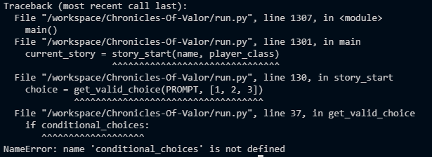

# Chronicles of Valor
Chronicles of Valor is a Python terminal text-based adventure game, which runs in the Code Institute mock terminal on Heroku.

Users can explore the world of Cydoia in this Jack and the Beanstalk inspired adventure, playing as their favorite class between a Fighter, Rogue or a Wizard. Every class has specific and unique available choices with wich the user can shape the story as they like.

[Here is the live version of my project.](https://chronicles-of-valor-8373a8ffd135.herokuapp.com/)

# How to play
Chonicles of Valor is based on the classic 80s text-based games, and it introduces the flourishing continent of Cydoia, rich of adventures.

The user will be introduce to the adventure and asked for their name. The user can input any name, as long as there are no numbers in it and they input at least one character. The user will then be able to choose their prefered class to play as. To do so they will have to input the number of their choice to the program. After that, the adventure will begin and the user just has to continue inputting the number of their choices and see how the story changes and shapes based on their choices.

The story is completely original made by myself, highly inspired by the story of Jack and the Beanstalk and the popular TTRPG Dungeons & Dragons for the Wizard spells.

The game offers unique choices based on the class the user chose and different options also have a random outcome to them, allowing for replayability for possible different outcomes to the story.

The game has many endings, some that are bad and quickly available, some that let's the user win the game.

# Features
## Existing Features

 - Text based input for the user's name.
	 - The user is asked to input their name. The program will accept the input only if the user doesn't use any number and they write at least one character. If the input is invalid, an error message will appear, asking the user to input a valid name.

 - Number based inputs for the user's choices throughout the game.
	 - The user will be asked to write the number of their choice. When trying to input blank, when trying to input a number above the number of choices and when trying to input letters, error messages will appear, telling the player their input is not valid, and to please input a valid one instead.

- Follow the story based on the user's choices.
- Specific and unique options available only with certain classes.
	- The program will take in consideration which class the user chose, and will provide unique choices only if the user took specific classes, using game states.

- Possible random outcomes with specific choices.
	- Just like Dungeons & Dragons, some actions from the players will be hard to complete and might end in failing to do the desired action. That's why this program has a random outcome function for specific actions that might end up in a failure and possibly the end of the game for the user, or the user might succeed a be able to continue their adventure.
	- Some of these random outcomes are also class specific, being that some classes might have some advantages in doing the desired action, so they have a wider range of success, and also some of the outcomes are for specific class only to succeed, while the other classes will always get the negative outcome, not having the skills to succeed on that desired action.

## Future Features
- Secret ending based on specific game states being unlocked by choosing specific choices throughout the game, hinting to a possible future story.
- Expanding the endings of the story about the father of the little girl.

# Testing
I have manually tested this project by doing the following:
- Passed the code through the CI Python Linter Checker provided by Code Institute and confirmed there are no problems.
- Given invalid inputs: given numbers when strings are expected, given strings when numbers are expected, given blank inputs, given numbers outside the valid inputs range.
- Tested in my local terminal and the Code Institute Heroku terminal.
- More unique choices for different classes.
- More complicated inputs asked to the user, for example puzzles and riddles, probably implemented in the possible secret ending.

# Bugs
**Solved Bugs**
- When I first introduced game states to the code, I created the variable conditional_choices, but never defined. I fixed this by adding `conditional_choices = []` to the global variables.

- When I first checked my code through the CI Python Linter, it was full of trailing white spaces, under-indented continuation lines and lines that were too long for the code. I fixed all of these problems by rewriting my entire code multiple times.

**Remaining Bugs**
- No bugs remaining.

**Validator Testing**
- CI Python Linter
	- After going through the entire code and fixing every encounter problem, no following errors were returned from the [PEP8 Python Checker](https://pep8ci.herokuapp.com/).

# Deployment
This project was deployed using Code Institute's mock terminal for Heroku.
- Steps for deployment:
	- Fork or clone this repository.
	- Create a new Heroku app.
	- Set the buildhacks to `Python` and `NodeJS` in that order.
	- Adding the `PORT`  `8000` to the config vars.
	- Link the Heroku app to the repository.
	- Click on **Deploy Branch**

# Credits
- Code Institute for the deployment terminal and the Python checker.
- My mentor Alan Bushell who helped me conceptualize the project and helped me greatly throughout the development.
